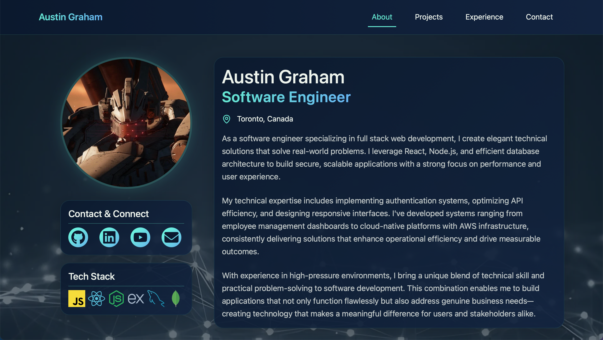
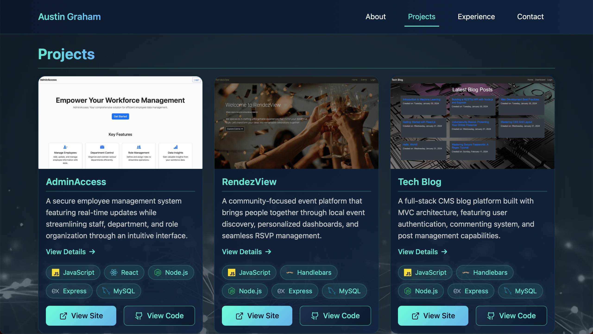
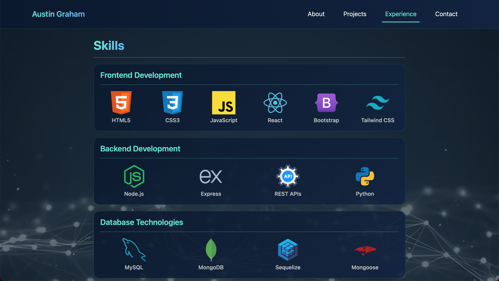
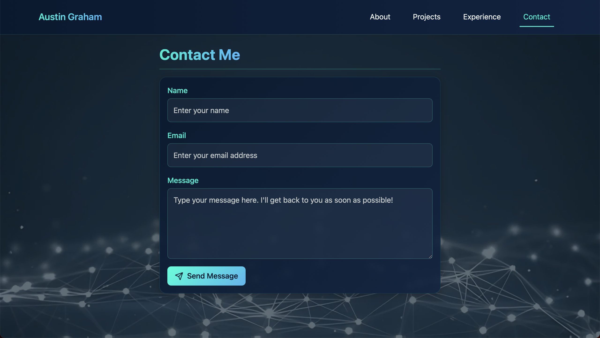

# React Portfolio
*A React-powered portfolio showcasing my journey in web development*

## Built With
[](https://developer.mozilla.org/en-US/docs/Web/JavaScript)
[](https://react.dev/)
[](https://developer.mozilla.org/en-US/docs/Web/CSS)
[](https://getbootstrap.com/)
[](https://vitejs.dev/)
[](https://www.netlify.com/)

## Table of Contents
- [Description](#description)
  - [Deployed Site](#deployed-site)
- [Features](#features)
- [Screenshots](#screenshots)
- [Technical details](#technical-details)
  - [Accessibility](#accessibility)
  - [Security](#security)
- [Installation](#installation)
  - [Usage](#usage)
- [License](#license)
- [Questions](#questions)

## Description
More than just a showcase of projects, this React portfolio represents my commitment to creating web experiences that are both technically sophisticated and user-centric. As a web developer, I believe great design goes beyond aesthetics—it's about crafting intuitive, accessible, and performant applications that solve real-world problems.

By leveraging modern technologies like React, I've built a portfolio that not only demonstrates my technical skills but also embodies my core development principles: accessibility, seamless user experience, and attention to detail. Each line of code reflects my passion for creating digital solutions that are inclusive, responsive, and engaging.

Whether you're a potential employer, collaborator, or fellow developer, this portfolio is an invitation to explore my approach to web development—where innovation meets intentional design.

### Deployed Site
View my portfolio at [austingraham.ca](https://austingraham.ca)

## Features
* **Mobile-Responsive Design**
  * Mobile-first approach with adaptive layouts for seamless experience across all devices
  * Hamburger-style navigation menu for smaller screens, closing on clicks outside the menu

* **Accessibility**
  * Fully keyboard navigable
  * Comprehensive ARIA attributes for enhanced screen reader compatibility
  * "Back to Top" button optimized for keyboard navigation users

* **Contact Form**
  * Interactive form with real-time validation
  * Advanced spam prevention using honeypot technique

* **Performance & SEO**
  * Unique meta tags for each route
  * Semantic HTML for improved search engine indexing
  * Social media meta tags for optimal content sharing

* **Project Showcase**
  * Tech stack icons for each project
  * Expandable project details via modals
  * Links to both live sites and source code repositories

* **Design & User Experience**
  * Smooth animations and transitions
  * Custom favicon and consistent branding
  * Clean, modern user interface

## Screenshots





## Technical Details
This portfolio website was built using the following technologies and libraries:

* **React**: The website is built using the React JavaScript library, leveraging various hooks to manage state, side effects, and DOM interactions:
   * `useState`: Manages local component state, primarily for handling user inputs in the contact form.
   * `useEffect`: Handles side effects like managing the `hashchange` event for back-to-top functionality and controlling the mobile navigation menu's behavior.
   * `useRef`: Provides references to DOM elements, enabling precise interactions such as tracking the navigation menu and toggle button, and implementing focus management.
* **React Router**: The `react-router-dom` library is used for handling client-side routing between different pages of the portfolio.
* **Vite**: The project is built using Vite, a fast build tool and development server for modern web applications.
* **Bootstrap**: Bootstrap is used for certain UI components such as cards and buttons, as well as for spacing utilities (margin and padding). The rest of the styles are implemented using regular CSS.
* **Framer Motion**: The `framer-motion` library is utilized for adding animations throughout the website. The animations are kept simple and short (around 0.3 seconds) to ensure they don't interfere with usability and readability.
* **Lucide React**: The `lucide-react` library is used for various icons across the website.
* **Font Awesome**: The `@fortawesome` packages are used for social icons (GitHub, LinkedIn, YouTube).
* **React Helmet**: The `react-helmet` library is employed to manage the meta tags for each page (route) separately, enhancing SEO alongside proper semantic HTML elements and accessibility features.

### Accessibility
The website has been refactored to ensure accessibility for users who rely on keyboard navigation and/or screen readers. This includes:

* Proper use of ARIA attributes for improved accessibility with screen readers.
* A back-to-top functionality specifically designed for keyboard navigation users, allowing them to easily return to the top of the page and regain focus on the corresponding page's navigation link.
* Careful consideration of animation durations to prevent interference with usability and readability.

### Security
To prevent spam submissions on the contact form, a honeypot technique leveraging security through obscurity is employed. An invisible form field, strategically positioned and hidden via CSS, sits between standard form inputs. Automated bots, which typically parse and fill all DOM elements indiscriminately, will populate this concealed field, causing the form submission to be automatically flagged as spam by the form processing service. Genuine users won't see or interact with this field.

## Installation
To install this project locally, follow these steps:

1. Clone the repository to your local machine.
    ```bash
    git clone https://github.com/kyoriku/react-portfolio.git
    ```
2. Navigate to the project directory.
    ```bash
    cd react-portfolio
    ```
3. Install the necessary dependencies
    ```bash
    npm install
    ```

### Usage
**Running Locally**
- To run the project locally, use the following command:
  ```bash
  npm run dev
  ```
  This will start the development server and open the portfolio in your default web browser.

**Building for Production**
- To build the project for production, use the following command:
  ```bash
  npm run build
  ```
  This will create a production-ready build of the portfolio, optimized for performance and ready to be deployed to your hosting provider.

## License
[](https://opensource.org/licenses/MIT)

This project is licensed under the [MIT](https://opensource.org/licenses/MIT) license - see the LICENSE file for details.

## Questions
For any questions, feel free to email me at hello@austingraham.ca.