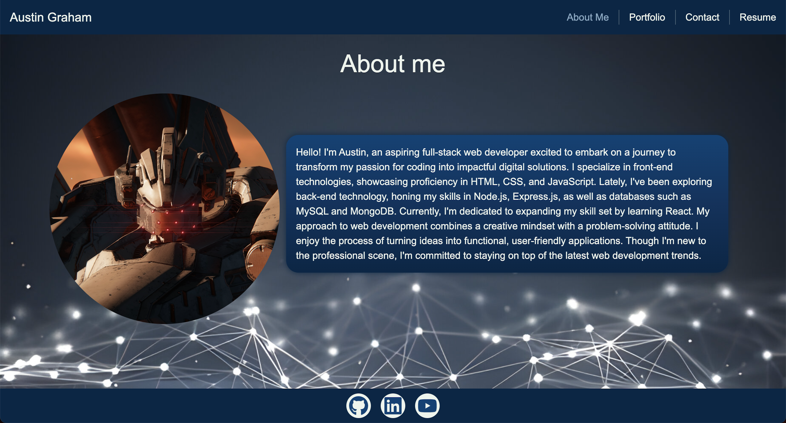
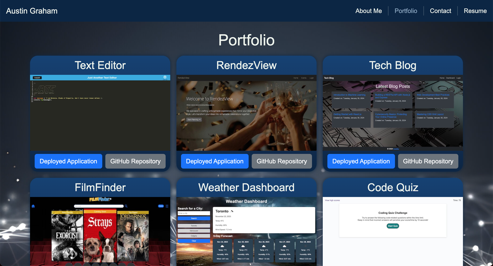
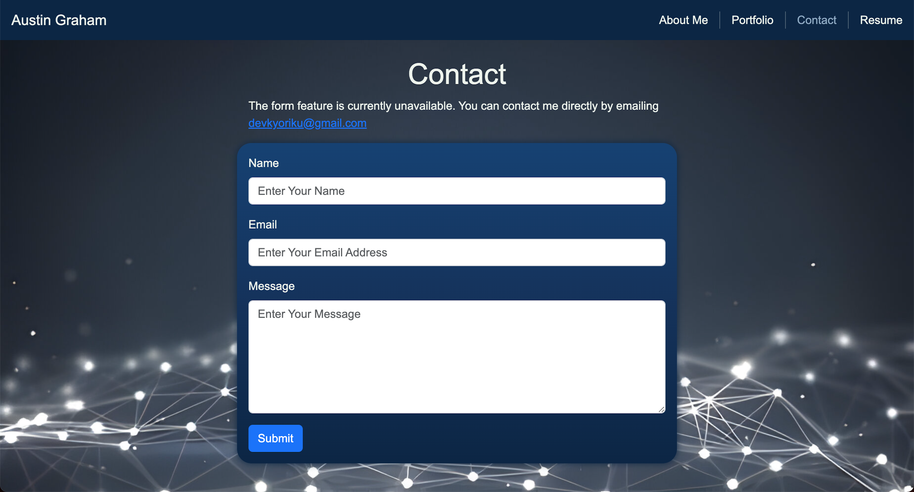
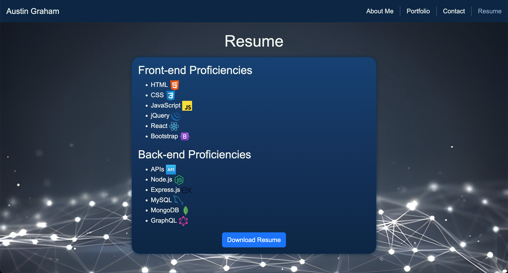

# React Portfolio
[](https://opensource.org/licenses/MIT)

## Built With
[](https://developer.mozilla.org/en-US/docs/Web/JavaScript)
[](https://nodejs.org/en)
[](https://www.npmjs.com/)
[](https://react.dev/)
[](https://vitejs.dev/)
[](https://getbootstrap.com/)
[](https://fontawesome.com/)
[](https://www.netlify.com/)

## Description
Welcome to my React portfolio! As a passionate and dedicated web developer, I've created this portfolio to showcase my recent projects and skills using the latest technologies. Leveraging the power of React, I've crafted a modern and dynamic single-page application that not only highlights my technical expertise but also provides an engaging user experience.

In today's competitive job market, having a standout portfolio is essential for attracting potential employers and clients. With this in mind, I've meticulously designed each section of my portfolio to meet the needs of recruiters and hiring managers looking for candidates with experience in building single-page applications.

Using a combination of sleek design elements, intuitive navigation, and responsive layouts, my portfolio offers a seamless browsing experience across various devices. Whether you're viewing it on a desktop, tablet, or smartphone, you can easily explore my projects, learn more about my background and skills, and get in touch for potential collaborations.

By incorporating React into my portfolio, I've demonstrated my proficiency in one of the most popular JavaScript libraries used for building user interfaces. From creating reusable components to managing state and routing, I've applied best practices to deliver a polished and professional portfolio that sets me apart from other candidates.

I believe that a well-crafted portfolio is not just a showcase of technical skills but also a reflection of one's personality, creativity, and passion for web development. Through this portfolio, I hope to convey my enthusiasm for building innovative web solutions and contribute to meaningful projects that make a positive impact in the digital world.

Thank you for visiting my portfolio, and I look forward to connecting with you!

## Table of Contents
- [Deployment](#deployment)
- [Installation](#installation)
- [Usage](#usage)
- [License](#license)
- [Contributing](#contributing)
- [Questions](#questions)

## Deployment
The React Portfolio is deployed on Netlify. You can access the live application [here](https://kyoriku-react-portfolio.netlify.app/).

## Installation
To install this project locally, follow these steps:

1. Clone the repository to your local machine.
    ```bash
    git clone https://github.com/kyoriku/react-portfolio.git
    ```
2. Navigate to the project directory.
    ```bash
    cd react-portfolio
    ```
3. Install the necessary dependencies
    ```bash
    npm install
    ```

## Usage
### Running Locally
- To run the project locally, use the following command:
  ```bash
  npm start
  ```
  This will start the development server and open the portfolio in your default web browser.

### Building for Production
- To build the project for production, use the following command:
  ```bash
  npm run build
  ```
  This will create a production-ready build of the portfolio, optimized for performance and ready to be deployed to your hosting provider.

### Screenshots





## License
This application is covered by the [MIT](https://opensource.org/licenses/MIT) license.

## Contributing
If you want to contribute to this project, follow these steps:

1. Fork the repository.
2. Create a new branch for your feature or bug fix.
3. Make your changes and commit them with descriptive commit messages.
4. Push your changes to your branch.
5. Submit a pull request, explaining your changes.

## Questions
If you have any questions, please contact [kyoriku](https://github.com/kyoriku) or email devkyoriku@gmail.com.