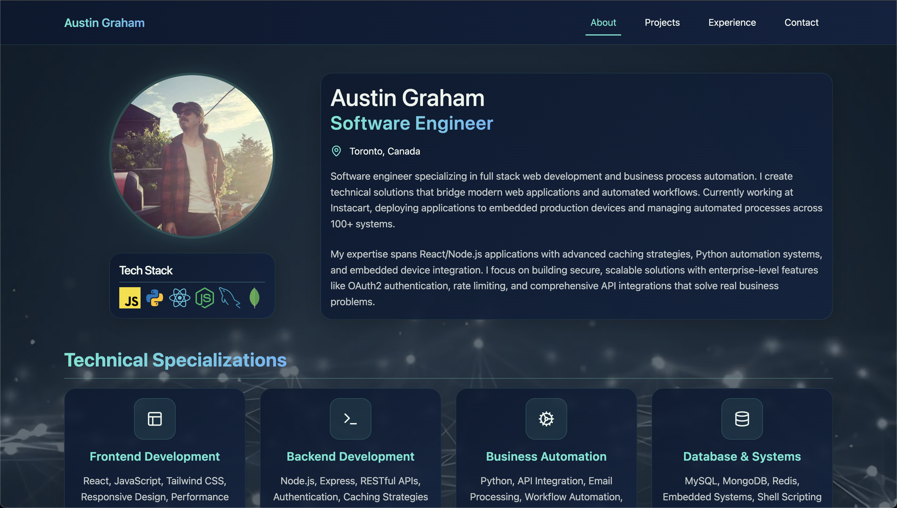
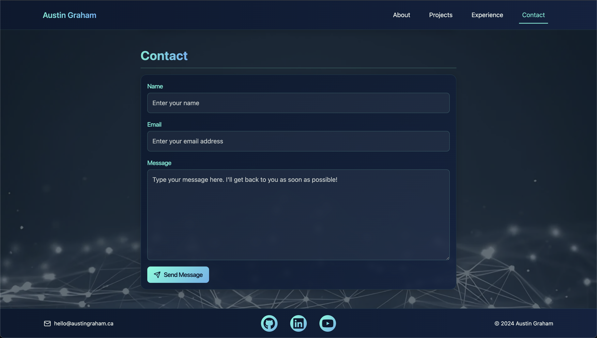

# React Portfolio

Personal portfolio built with React showcasing web development projects.

**[Live Site](https://austingraham.ca)** | **Tech Stack:** React, Bootstrap, Framer Motion



<details>
<summary><b>Built With</b></summary>

[](https://react.dev/)

[](https://developer.mozilla.org/en-US/docs/Web/JavaScript)
[](https://tailwindcss.com/docs/installation/using-vite)

</details>

## Table of Contents
- [Technical Details](#technical-details)
- [Screenshots](#screenshots)
- [Installation](#installation)
- [License](#license)
- [Questions](#questions)

## Technical Details

**Frontend**
- React with hooks (useState, useEffect)
- Vite for build tooling
- Tailwind CSS for styling
- Lucide React for icons

**Features**
- Single-page application with smooth scroll navigation
- Mobile-responsive with hamburger menu
- Contact form with validation and honeypot spam prevention
- Project showcase with modals and tech stack display
- SEO optimized with structured data

**Accessibility**
- ARIA labels for screen readers
- Keyboard navigation support
- Form autocomplete attributes
- 100/100 Lighthouse accessibility score

**Security**
- Content Security Policy headers
- Honeypot spam prevention in contact form

## Screenshots
<details>
<summary><b>View More Screenshots</b></summary>




</details>

## Installation

1. Clone the repository
    ```bash
    git clone https://github.com/kyoriku/react-portfolio.git
    ```

2. Navigate to the project directory
    ```bash
    cd react-portfolio
    ```

3. Install dependencies
    ```bash
    npm install
    ```

4. Run locally
    ```bash
    npm run dev
    ```

5. Build for production
    ```bash
    npm run build
    ```

## License
[](https://opensource.org/licenses/MIT)

This project is licensed under the [MIT](https://opensource.org/licenses/MIT) license.

## Questions
For questions, email me at devkyoriku@gmail.com.